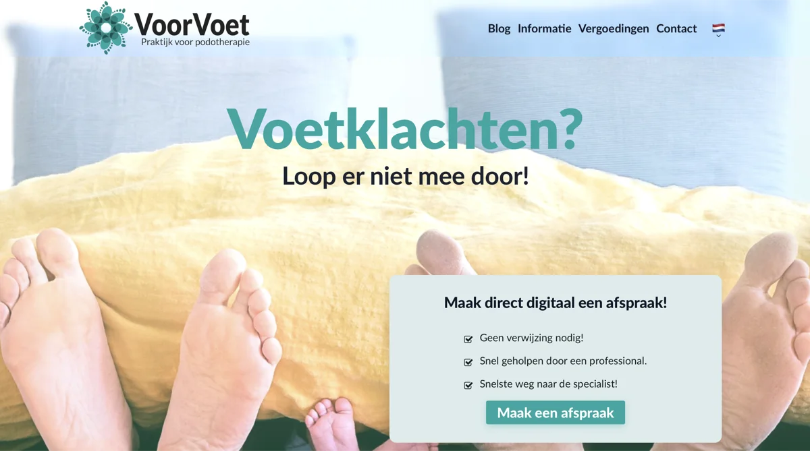

# VoorVoet - Praktijk voor podotherapie



Multi-language website for VoorVoet podiatry practice built with Reflex (Python web framework). Supports Dutch (primary), German, and English.

## Key Features
- 🌍 Multi-language support (NL/DE/EN)
- 📝 Markdown-based blog system
- 📧 Contact form with Cloudflare Turnstile
- 🎨 Responsive design with custom theme system
- 🦶 Insole ordering functionality

## Quick Start
This project requires a working Python environment and uv.
```bash
uv sync                    # Install dependencies
uv run reflex run          # Start development server
uv run reflex compile      # Test compilation
```

## Documentation
- **[Deployment Guide](documents/deployment.md)** - Production deployment instructions
- **[SMTP Setup](documents/smpt_server_setup.md)** - Email server configuration
- **[Image Guidelines](documents/image_guidelines.md)** - Image optimization and usage

## Configuration

Copy `.env.example` to `.env` and configure:
- Cloudflare Turnstile keys
- SMTP credentials
- Blog display settings
